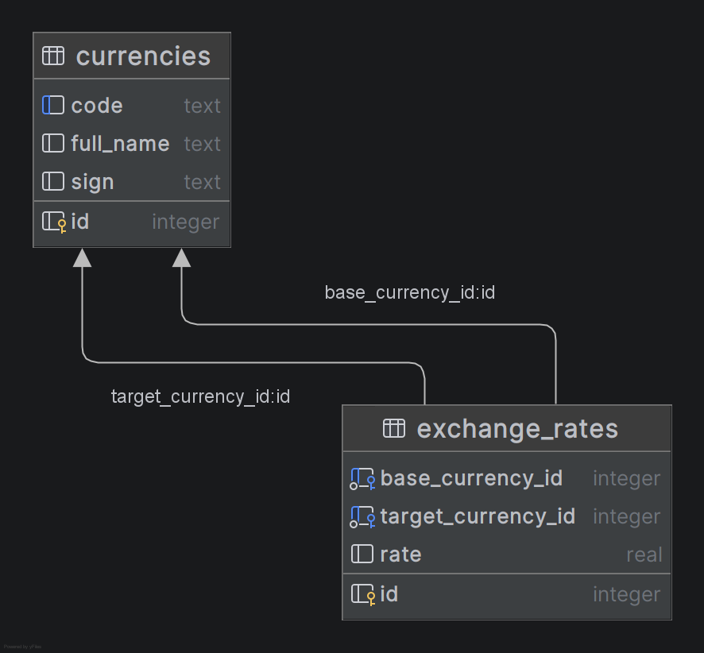

# CURRENCY EXCHANGER


**Currency exchanger** - это REST API для описания валют и обменных курсов. Позволяет просматривать и редактировать
списки валют и обменных курсов, совершать расчёт конвертации произвольных сумм из одной валюты в другую.

Учебный проект выполнен на Java с использованием Jakarta Servlet API и JDBC. Целью проекта является практика работы с
базой данных и построения корректной архитектуры веб-приложения.

## Быстрый старт

Проект максимально автоматизирован и готов к работе сразу после сборки.

### Предварительные требования

* _Java 21_

* _Apache Tomcat 11.0.2_

* _Maven 3.9.6_

### Инструкция по сборке

**1. Сборка проекта:**

Соберите проект с помощью Maven. Это создаст готовый к развертыванию артефакт:

```
mvn clean package
```

**2. Запуск на сервере:**

- Скопируйте файл _target/currency-exchanger-1.0.war_ в папку _webapps_ вашего Tomcat 11.

- Запустите Tomcat.

Приложение автоматически:

* создаст директорию currency-exchanger-DB в вашей домашней папке;
* инициализирует файл базы данных currency_exchanger.db;
* развернет структуру таблиц из SQL-скрипта.

API и веб-интерфейс будут доступны по адресу:
http://localhost:8080/currency-exchanger

## Стек

При разработке были задействованы следующие инструменты:

* _Java 21_

* _Apache Tomcat 11.0.2_

* _SQLite 3.53.0_

* _Maven 3.9.6_

**Библиотеки:**

_HikariCP + SLF4J, MapStruct, Jackson_

**Интерфейс:**

В проект интегрирован базовый веб-интерфейс для взаимодействия с REST API
[[ссылка на первоисточник](https://github.com/zhukovsd/currency-exchange-frontend)]

## Архитектура проекта

```text
currency-exchanger
        │   pom.xml
        └───src
             └───main
                 ├───java
                 │   └───com
                 │       └───project
                 │           ├───controller
                 │           ├───dao
                 │           ├───database
                 │           ├───dto
                 │           ├───exception
                 │           ├───factory
                 │           ├───filter
                 │           ├───listener
                 │           ├───mapper
                 │           ├───model
                 │           ├───provider
                 │           ├───service
                 │           └───util
                 ├───resources
                 └───webapp
                     │   index.html
                     ├───css
                     └───js
```

## Схема API

### Получение списка валют

`GET /currencies`

Пример ответа:

```json
[
  {
    "id": 1,
    "code": "USD",
    "name": "US Dollar",
    "sign": "$"
  },
  {
    "id": 2,
    "code": "AUD",
    "name": "Australian Dollar",
    "sign": "A$"
  }
]
```

**Ожидаемые коды ответов:**

| Код ответа | Описание |
|------------|----------|
| 200        | Успех    |
| 500        | Ошибка   |

### Добавление новой валюты в базу

`POST /currencies`

**Пример ответа:**

```json
[
  {
    "id": 13,
    "code": "XCD",
    "name": "Eastern Caribbean Dollar",
    "sign": "EC$"
  }
]
```

**Ожидаемые коды ответов:**

| Код ответа | Описание                                                           |
|------------|--------------------------------------------------------------------|
| 201        | Успех                                                              |
| 400        | Отсутствует нужное поле формы /<br/>некорректный ввод пользователя |
| 409        | Валюта с таким кодом уже существует                                |
| 500        | Ошибка                                                             |

### Получение конкретной валюты

`GET /currency/{CURRENCY_CODE}`

**Пример ответа:**

```json
[
  {
    "id": 4,
    "code": "RUB",
    "name": "Russian Ruble",
    "sign": "₽"
  }
]
```

**Ожидаемые коды ответов:**

| Код ответа | Описание                                                             |
|------------|----------------------------------------------------------------------|
| 200        | Успех                                                                |
| 400        | Код валюты отсутствует в адресе /<br/>некорректный ввод пользователя |
| 404        | Валюта не найдена                                                    |
| 500        | Ошибка                                                               |

### Получение списка всех обменных курсов

`GET /exchangeRates`

**Пример ответа:**

```json
[
  {
    "id": 5,
    "baseCurrency": {
      "id": 5,
      "code": "XOF",
      "name": "CFA Franc BCEAO",
      "sign": "XOF"
    },
    "targetCurrency": {
      "id": 4,
      "code": "RUB",
      "name": "Russian Ruble",
      "sign": "RUB"
    },
    "rate": 0.1349
  }
]
```

**Ожидаемые коды ответов:**

| Код ответа | Описание                                                                  |
|------------|---------------------------------------------------------------------------|
| 200        | Успех                                                                     |
| 400        | Коды валют пары отсутствуют в адресе /<br/>некорректный ввод пользователя |
| 404        | Обменный курс для пары не найден                                          |
| 500        | Ошибка                                                                    |

### Добавление нового обменного курса в базу

`POST /exchangeRates`

Дополнение: данные передаются в теле запроса в виде полей формы _(x-www-form-urlencoded)_.

Поля формы - baseCurrencyCode, targetCurrencyCode, rate.

**Пример ответа:**

```json
[
  {
    "id": 6,
    "baseCurrency": {
      "id": 1,
      "code": "USD",
      "name": "US Dollar",
      "sign": "USD"
    },
    "targetCurrency": {
      "id": 5,
      "code": "XOF",
      "name": "CFA Franc BCEAO",
      "sign": "XOF"
    },
    "rate": 559.82
  }
]
```

**Ожидаемые коды ответов:**

| Код ответа | Описание                                                           |
|------------|--------------------------------------------------------------------|
| 201        | Успех                                                              |
| 400        | Отсутствует нужное поле формы /<br/>некорректный ввод пользователя |
| 404        | Одна (или обе) валюта из валютной пары не существует в БД          |
| 409        | Валютная пара с таким кодом уже существует                         |
| 500        | Ошибка                                                             |

### Получение конкретного обменного курса

`GET /exchangeRate/{BASE_CURRENCY_CODE}{TARGET_CURRENCY_CODE}`

Дополнение: валютная пара задаётся идущими подряд кодами валют в адресе запроса.

**Пример ответа:**

```json
[
  {
    "id": 6,
    "baseCurrency": {
      "id": 1,
      "code": "USD",
      "name": "US Dollar",
      "sign": "USD"
    },
    "targetCurrency": {
      "id": 5,
      "code": "XOF",
      "name": "CFA Franc BCEAO",
      "sign": "XOF"
    },
    "rate": 559.82
  }
]
```

**Ожидаемые коды ответов:**

| Код ответа | Описание                                                                  |
|------------|---------------------------------------------------------------------------|
| 200        | Успех                                                                     |
| 400        | Коды валют пары отсутствуют в адресе /<br/>некорректный ввод пользователя |
| 404        | Обменный курс для пары не найден                                          |
| 500        | Ошибка                                                                    |

### Обновление существующего в базе обменного курса

`PATCH /exchangeRate/{BASE_CURRENCY_CODE}{TARGET_CURRENCY_CODE}`

Дополнение: валютная пара задаётся идущими подряд кодами валют в адресе запроса.

Данные передаются в теле запроса в виде полей формы _(x-www-form-urlencoded)_. Единственное поле формы - rate.

**Пример ответа:**

```json
[
  {
    "id": 8,
    "baseCurrency": {
      "id": 13,
      "code": "XCD",
      "name": "Eastern Caribbean Dollar",
      "sign": "XCD"
    },
    "targetCurrency": {
      "id": 4,
      "code": "RUB",
      "name": "Russian Ruble",
      "sign": "RUB"
    },
    "rate": 27.97
  }
]
```

**Ожидаемые коды ответов:**

| Код ответа | Описание                                                           |
|------------|--------------------------------------------------------------------|
| 200        | Успех                                                              |
| 400        | Отсутствует нужное поле формы /<br/>некорректный ввод пользователя |
| 404        | Валютная пара отсутствует в базе данных                            |
| 500        | Ошибка                                                             |

### Расчёт перевода определённого количества средств из одной валюты в другую

`GET /exchange?from={BASE_CURRENCY_CODE}&to={TARGET_CURRENCY_CODE}&amount={AMOUNT}`

**Пример ответа:**

```json
[
  {
    "baseCurrency": {
      "id": 1,
      "code": "USD",
      "name": "US Dollar",
      "sign": "$"
    },
    "targetCurrency": {
      "id": 4,
      "code": "RUB",
      "name": "Russian Ruble",
      "sign": "₽"
    },
    "rate": 75.53,
    "amount": 32442.432,
    "convertedAmount": 2450376.89
  }
]
```

**Ожидаемые коды ответов:**

| Код ответа | Описание                                                               |
|------------|------------------------------------------------------------------------|
| 200        | Успех                                                                  |
| 400        | Отсутствует нужное поле формы /<br/>некорректный ввод пользователя     |
| 404        | Обменный курс для пары не найден/<br/>валюта отсутствует в базе данных |
| 500        | Ошибка                                                                 |

## Схема базы данных

### Таблицы

Таблица **_CURRENCIES_**:

| Column    | Type    | Constraints                |
|-----------|---------|----------------------------|
| id        | INTEGER | primary key, autoincrement |
| code      | TEXT    | unique index               |
| full-name | TEXT    |                            |
| sign      | TEXT    |                            |

Таблица **_EXCHANGE_RATES_**:

| Column             | Type    | Constraints                |
|--------------------|---------|----------------------------|
| id                 | INTEGER | primary key, autoincrement |
| base_currency_id   | INTEGER | foreign key, not null      |
| target_currency_id | INTEGER | foreign key, not null      |
| rate               | REAL    |                            |

- содержит _unique index_ для пары `base_currency_id` и `target_currency_id`

### Диаграмма связей

